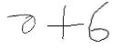

# machine-learning-equation-solver
A kinda sub-par machine learning model I trained to recognise numbers and operators.
Sorta like MNIST but the data given was a lot more un-processable.

---

## Task
Your task is to evaluate math expressions presented in the form of images. The images are black and white and are of dimensions (55, 135). Some examples are shown below!

|Example 1   |
|------------|
|	|

As you might have noticed, all the mathematical expressions are of this format:

> (number) (operator) (number)

The numbers are single-digit numbers from 0 to 9, while the operator can be anything from addition, subtraction, multiplication and division. For the purposes of this competition, there will be no division by zero cases.

The description of the dataset can be found in the 'Data' tab. Please refer to 'Submission' and 'Evaluation' to read more about how to submit and how the predictions are graded.

#### Acknowledgements
The dataset has been adapted from CROHME: Competition on Recognition of Online Handwritten Mathematical Expressions, which is available for academic and research purposes. For more information, visit their site at http://www.isical.ac.in/~crohme/index.html.

---
