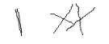

# Machine Learning Equation Solver
A kinda sub-par(not for long hopefully) machine learning model I trained to recognise numbers and operators.
Sorta like MNIST.
---

## Task
The task is to evaluate math expressions presented in the form of images. The images are black and white and are of dimensions (55, 135). An example is shown below:

|Example 1   |
|------------|
|	|

As you might have noticed, all the mathematical expressions are of this format:

> (number) (operator) (number)

As you might also have noticed, the images aren't exactly the cleanest (the first number in the example is a 0, btw).

The numbers are single-digit numbers from 0 to 9, while the operator can be anything from addition, subtraction, multiplication and division. There will be no division by zero cases.

---

## How to use
Run preprocessing.ipynb, train-and-test.ipynb and process-results.ipynb in order.

---

## Process

### Preprocessing
For preprocessing, the lines in the image data were way too skinny for any features to be extracted, so they had to be made thicker. I attempted to use both a dilating function to thicken the lines and a combination of blurring and binary threshold to bleed the edges out and make them thicker. After that, the equation had to be split into its constituent parts, the first number, the operator, and the second number.

Due to how dirty the images were, I decided to train separate models for the numbers and the operators to avoid mixing them up, as some numbers in the set looked very similar to some operators and vice versa. Here's a good example:

After this, we can simplify the images by downscaling them and cropped 3 28x28 regions corresponding to the respective components of the equation.

### Training
The models are built using a pretty standard multiclass classifier. Numbers have a final Softmax layer with 10 nodes (0-9) and operators have a final Softmax layer with 4 nodes (+-\*/). Note that Keras does not support string hot-encoding, and the train.csv given had named classes for the operators (plus, minus, times, divide), so before training the operator classifier we must manually encode the classes as integers (0-4, in this case).

Note: This model is subject to change as I continue to tune the hyperparameters and improve the accuracy of the model.

### Postprocessing
After getting the constituent results, the postprocessing script brings them all together and calculates a single output rounded to 2 decimal places. In cases where the model classifies the operator as a divisor and wrongly classifies the second number as zero, a division by zero error will emerge. In such cases, we assume that the second number is a 6, as 6 is the closest in shape to 0. It's a bit hacky, but I'm hoping we won't need this step after the hyperparameters are tuned sufficiently.

---

## Acknowledgements
- The dataset has been adapted from CROHME: Competition on Recognition of Online Handwritten Mathematical Expressions, which is available for academic and research purposes. For more information, visit their [site](http://www.isical.ac.in/~crohme/index.html).
- Big ups to [Kingold](https://github.com/kgwxf) for helping me with the preprocessing, more precisely the downscaling and splitting of the images into its components.
